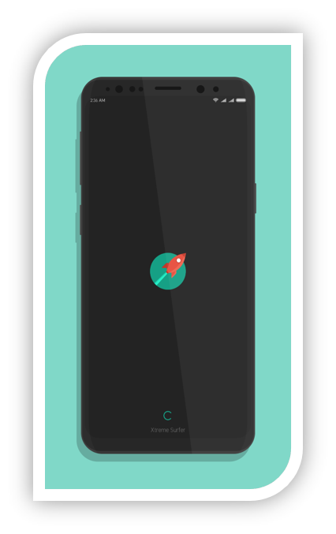
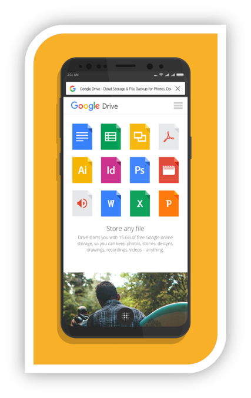
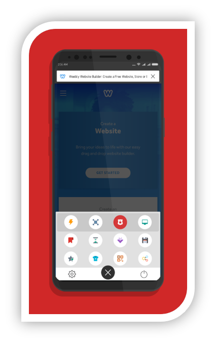
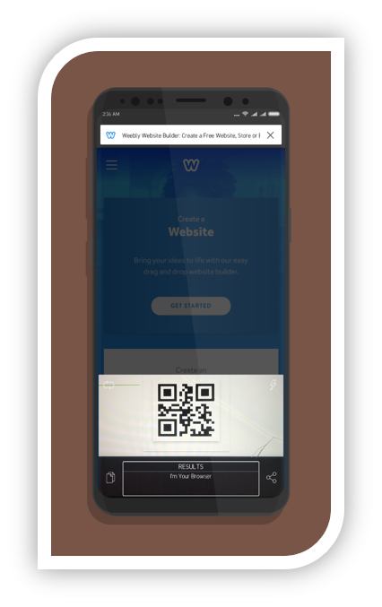
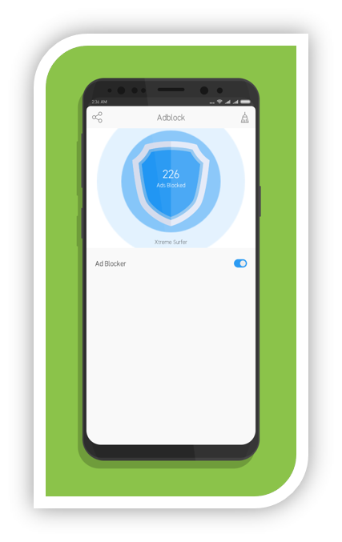

# Surfer Browser
**Surfer** is a modern web browser mobile application, based on **Google Chromium Webview** API hence, fast enough for all browsing needs. Chromium API is an open source library that is actually being used in Google’s own browser **Google Chrome**, so Surfer’s speed is quite predictable.

## Features
-	Built-in ad blocker, that filters out all annoying ads for a clean user experience.
-	Built-in QR scanner, to dive into website without having to type it manually.
-	Stunning user interface, to keep you enchanted while browsing through web.
-	Built-in Theme Engine, for a daily dose of unique appearance.
-	Seamless voice controls, for navigating between websites smoothly.

### Speed
Waiting for loading webpage is not the case for **Surfer Browser**. It can handle all network conditions easily, as intelligent caching mechanism offered by **Google Chromium Webview** API is just perfect. **Surfer browser** is powered by this API hence, you won't feel any lags while browsing the web.  

### Ad Blocker
No one like ads on websites they visit. Ads not just irritate us by weird appearance but spoils overall expirience of website too. Thus **Surfer Browser** is packed up with its own **Ad Blocker** with a decent algorithm to filter out ads on website. It replaces the **Ad block** with a blank html block to preserve basic structure of website.  

### QR Scanner
Those days were not bad when we had a separate application for scanning **QR Codes**. But how about having a similar scanner embedded with browser itself ? Yes, snapping and visiting a website is lot more easy than typing complete URL. Browsing can't be more easy than this.  

## Screenshots

## Download  
**Surfer Browser** mobile application is packed with lot of features and ideal for any anybody who likes surfing over internet. Get your hands on it for free.  

